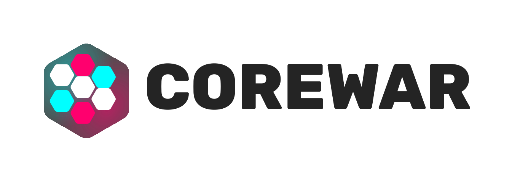

<picture>
 <source media="(prefers-color-scheme: dark)" srcset="./assets/darkmode-titlebar.svg">
 
</picture>

    
    
    
    

## Whats in here?
We recently split up our monorepo. This repo is a result of that, containing an implementation of the frontend for our
Corewar app written in React. Ideally, you will later be able to write your own frontends or use a third party
implementation to configure you own "Corewar-Stack".

## About Corewar

[Corewar](https://en.wikipedia.org/wiki/Core_War) is a game where two or more players write competing assembly programs in a [custom assembly language called Redcode](https://github.com/corewar-teamprojekt/corewar/wiki/Redcode), aiming to control a shared virtual memory space.

The game concept originated in 1984 and was first introduced in [this article](https://corewar.co.uk/standards/cwg.txt). Since then, a few implementations have emerged, but most have grown outdated or lack the features needed for a modern experience, especially for easily playing against friends or competing online.

This project aims to revitalize Corewar, bringing it to a whole new audience of tech enthusiasts. Happy hacking!

## Start playing
The current production deployment can be found [here](https://corewar.shonk.software/).

We deploy every active branch to https://$BRANCHNAME.corewar.shonk.software/ aswell.

### Local setup
To run the project locally, check out our [AIO-Container repo](https://github.com/shonk-software/corewar-aio-container-build)

## Technologies
This frontend for the app uses a [react](https://react.dev/) frontend with [shadcn](https://ui.shadcn.com/) as its core component library.

For more details regarding our architecture, check out [this drawio file](https://github.com/corewar-teamprojekt/corewar/blob/main/architecture.drawio).

## Contributing / Local setup

Please read [CONTRIBUTING.md](CONTRIBUTING.md) for details on our code of conduct, and the process for submitting pull requests to us.

## License

The Corewar project is open-sourced software licensed under the [Apache License](https://www.apache.org/licenses/LICENSE-2.0.txt). 
